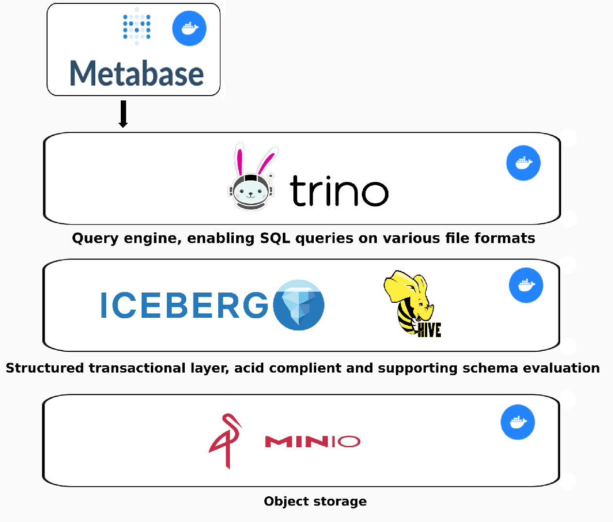

### Introduction 

Data Warehouses have been state of the art for analytic workloads since the 1980's with the emergence of Ralph Kimball's dimensional modeling. These were built to aggreagte structured data from different sources and run analytic queries on them to generate insights. 

Up until the emergence of cloud dwh's like Aws Redshift most data warehouses had stoarge and compute tightly coupled together. This made scaling inflexible since you could not independently scale storage from compute and vice versa. 

These deata warehouses however are quite expensive and do not support unstructured data. Moreover they are not suited for advanced analytic workloads. Data warehouses are also a single locked system, which means your data can just be accessed by the compute engine of the warehouse. 

__Data Lakes__

These drawbacks have been adressed by Data Lakes. These offer cheap storage and flexibility with data format and file type. In addition to that, they can be accessed by a wide variety of computational engines.

Individual datasets within data lakes are often organized as collections of files within directory structures, often with multiple files in one directory representing a single table. The benefits of this approach are that data is highly accessible and flexible. 
However, several concepts provided by traditional databases and data warehouses are not addressed solely by directories of files and require additional tooling to define. This includes:

- What is the schema of a dataset, including columns and data types
- Which files comprise the dataset and how are they organized (e.g., partitions)
- How different applications coordinate changes to the dataset, including both changes to the definition of the dataset and changes to data
- Making transactions ACID compliant 
- Enabling, Inserts, merges and timetravel etc. 

A solution are __Data Lakehouse__

Data Lakehouses still use the cheap and flexible storage of Data Lakes, but they add a layer of structure and governance to the data. They use open table formats like Apache Iceberg to provide schema enforcement, organization of files, and other traditional database-like features.

This enables Data Lakehouses to use traditional SQL-based tools and techniques to query and analyze the data, which makes it easier for both business analysts and data scientists to work with the data and find insights.

Overall, Data Lakehouses are a powerful tool for organizations that need to store and analyze large amounts of data. By combining the best aspects of Data Lakes and traditional Data Warehouses, Data Lakehouses provide a way to store and manage data that is both flexible and structured. This makes it easier for teams to collaborate, find insights, and make informed decisions.

In this repository I have built a sample Lakehouse architecture, deployed via. Docker compose. It can be used for local testing purposes or as a backend to your own data analysis projects, as a more real-life like solution compared to files on your own disk.

__Note:__ This project is only suited for testing purposes and not for a production deployment.

### Architecture of this lakehouse:



**Storage:**

As for the storage layer, I have chosen Minio, which is an open source, S3 compliant Object storage. Such a storage has less operational cost than a traditional data warehouses and enables us to store all types of data and formats. Moreover since it is decoupled from our query engine we can scale it independently, if we need additional storage but not more processing power. 

The storage in this project comes preconfigured with a bucket and 4 zones (via key prefixes):
- raw
- bronze
- silver 
- gold 

This is according to the medaillon architecture, more on it can be found [here](https://www.databricks.com/glossary/medallion-architecture). 

Since it might be interesting to directly work with some data, I have added a parquet file about people, their jobs and their respective salarys which needs some cleaning, to the raw zone. You can clean it and create new tables with the refined data or directly visualize it using Meatbase.

**Table formats**

Table formats are a way to organize data files. They try to bring database-like features to the Data lake. This is one of the key differences between a Data Lake and Lakehouse. 

I have chosen Apache Iceberg, which in particular has the following advantages over Hudi and Delta tables:  

Iceberg is faster regarding insert and update operations as well as requiring less storage. 
Furthermore it lets you change partitions easily while data evolves, as well as making schema evolution possible with a multitude of query engines. 

**Schema Metastore**

The schemas, partitions and other metadata of the created tables needs to be stored in a central repository. This is what we use the Hive Metastore for. It consists of a Thrift Server and a relational database in the backend. In this case I have chosen MariaDB. 

With Apache Iceberg one could also use a JDBC Metastore, this however only works with Iceberg and does not let you create views. 

**Query engine**

Trino is a Query engine which lets you create and query tables based on flat files via. Iceberg. Moreover it support query federation, meaning you can join data from multiple different sources. Like all other services, Trino has been deployed in a Docker container.  

Trino itself works like a massively parallel processing databases query engine, meaning to scale instead of increasing processing power of one node, Trino simply adds more nodes. It is a connector based architecture, meaning Trino itself is only a query engine, relying on connectors to connect to all types of data sources. A database on the other hand has both coupled together the query engine and storage. The connector will translate the Sql statement to a set of API calls to the storage to retrieve the data. The users Sql query will then be 

Its architecture consists of a coordinator and multiple worker nodes. 

In this project the computational service (Trino) is decoupled from the storage and thus would allow for easy scalability in a production environment independent of the data storage. 

**BI Tool**

I have added and pre-configured Metabase as a BI Tool, in order for you to directly work with the Lakehouse. Metabase is also deployed in a container which has a volume with configurations mounted to it.

You can access metabase with the following credentials

Username: test
Password: test123!

### How to deploy it locally 

To run this project on your machine, you have to clone it and simply run a

```bash
docker compose up -d
```

Upon startup you already have a sample Iceberg table in the raw zone of your Lakehouse. It has been created using an init container which opens a Trino cli, connects to your instance and creates these tables. 